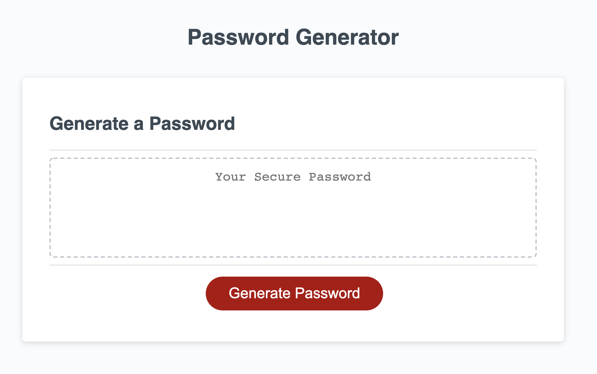

# Homework Assignment #3: Password Generator

## Overview

This assignment demonstrates skills learned in Week 3 of the bootcamp by creating a simple password generator app based on user input. The purpose of this project is to demonstrate my knowledge and understanding of Javascript, including functions, operations, variables, and loops.

> The HTML & CSS in this app was provided. The only code that was modified was the Javascript

## Link to Deployed Application

[password-generator](https://matthewbush55.github.io/password-generator/)

## Mock-Up

